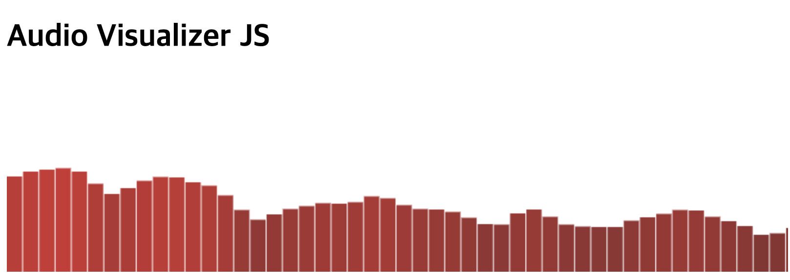

# Audio Visualizer JS

This NPM package provides a set of tools for visualizing audio data in web-based applications. Users can leverage this library to develop web-based audio players or visualization apps.



## Installation

```
npm install @hameee/audio-visualizer-js
```

## Usage

```javascript
import { startAudioContext } from './node_modules/@hameee/audio-visualizer-js/index.mjs';

// Declare the audioContext variable
let audioContext;

// Define the handler function starting the audio context and removing the event listener
const handleAudioContextStart = () => {
  startAudioContext(audioContext);
  document.removeEventListener('click', handleAudioContextStart);
};

// Add an event listener
document.addEventListener('click', handleAudioContextStart);
```

## Features

- Audio spectrum visualization
- Timing-based animation effects

## Contributing

Contributions are welcome! If you find a bug or have a feature request, please [open an issue](https://github.com/qwerty00ui88/audio-visualizer-js/issues/new). If you'd like to contribute code, please follow these steps:

1. Fork the repository
2. Create a new branch (`git checkout -b feature/my-feature`)
3. Make your changes and commit them (`git commit -am 'Add some feature'`)
4. Push to the branch (`git push origin feature/my-feature`)
5. Create a new Pull Request

## License

This project is licensed under the ISC License.

Please let me know if you have any other questions or if you'd like me to modify the README further. 